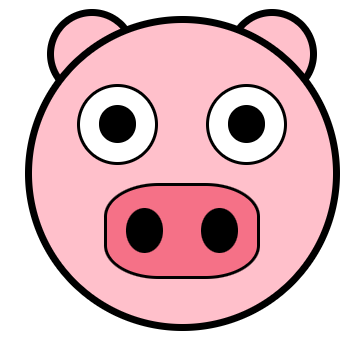

# Pig Emoji using HTML and CSS

## Objective

Objective is to create the pig emoji depicted below using
HTML and CSS only.

## The Specs of the Emoji

The emoji has the following characteristics (as per: https://www.algoexpert.io/):

- The head should be a perfect circle with a width and height of 200px, a top margin of 20px, and a background of #ffc0cb.
- The ears should be perfect circles, each with a width and height of 50px. They should be positioned behind the head and 10px inwards from the left and right edges of the head. They should also protrude above the head by 10px and they should have the same background color as the head.
- They eyes should be perfect circles, each with a width and height of 50px. They should be positioned 40px from the top, and 30px from the left and right edges of the head, respectively. They should have a background color of white.
- Each eye contains a pupil, which should be a perfect circle that is half the size of the eye. The pupils should be centered in their respective eye, and they should have a background color of black.
- The nose should have a width of 100px and a height of 60px. It should be horizontally centered and positioned 30px from the bottom of the head. Additionally, it should have a border radius of 35% and a background color of #f57187.
- The nose contains two nostrils, each with a height that is 50% of the height of the nose and a width that is 25% of the width of the nose. The nostrils should be vertically centered with horizontal space around them (twice as much space between them as from the edge of the nose). Additionally, they should have a border radius of 50% and a background color of black.
- The head and both ears should a solid, black, 5px border, while the nose and both eyes should have a solid black, 2px border.
